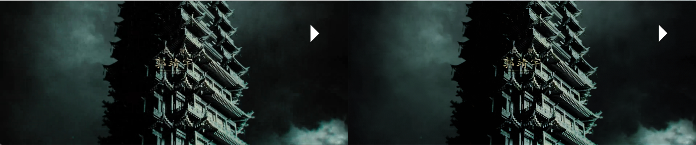

# AITranscoder

高保真的AI视频转码工具
<p id="icon" align="center">
  
</p>

极致低画质  
<p id="low_quality" align="center">
  
</p>
高清源画质
<p id="high_quality" align="center">
  
</p>


## 安装与系统要求
下载release包后解压后就可以使用。

系统：Windows11  
CPU：Intel CPU  
GPU：Intel集成显卡和独立显卡  
内存：16GB

360P -> 720P  
Intel Arc750 大概每秒9帧(受OpenVINO限制，预计80帧/秒，可以实时渲染)  
笔记本 Ultra-155H 大概能跑每秒2帧

## 使用说明

### Preview.exe 预览器

打开图片  
`.\previewer.exe lr.png`

打开视频  
`.\previewer.exe E001.mp4`

<p id="ui" align="center">
  
</p>

`'q'退出界面`  
`'s'保存当前的AI预览图`  

通过TimeLine选择视频进度条， 通过Q调节保真度。 不同的保真度将对AI模型效果产生影响。  
调试好保真度后记录下当前Q的数值，这个转码时候需要使用。

### Transcoder.exe 转码器

```
.\transcoder.exe -i E001.mp4 -b 8000 --p1 20
Usage: ffmpeg_transcoder [-h] [--fps VAR] [--bps VAR] [--in_scale VAR...] [--out_scale VAR...] [--encoder VAR] [--p1 VAR] [--p2 VAR] [--input_files VAR...]

Optional arguments:
  -h, --help            shows help message and exits
  -v, --version         prints version information and exits
  --fps                 frame rate per second [default: 15]
  -b, --bps             K bps of video encoder default auto select by out_scale resolution [default: -1]
  --in_scale            in_scale=xx xx [nargs: 2] [default: {0 0}]
  --out_scale           out_scale=xx xx [nargs: 2] [default: {0 0}]
  -e, --encoder         Select encoder one of ['h264','nvenc'] [default: "h264"]
  --p1                  parameter 1 [default: 70]
  --p2                  parameter 2 [default: 100]
  -i, --input_files     [nargs: 1 or more]
```

`-i 后面可以接多个视频文件 E001.mp4 E002.mp4 ...`  
`-b 转码后的文件码率，这个给低会导致保存的视频画质比预览的时候更低，推荐给到8000以上，根据分辨率变化`  
`--p1 保真度，数值对应是预览器的Q*10`  
`--in_scale 预先缩放输入图片`  
`--out_scale 缩放编码前的图片`  

