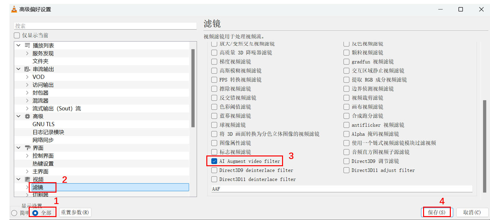

# AI Enhancement Filter [English](README_en.md)

**高保真的AI画质增强滤镜:**
* *[播放](#实时播放服务)*
* *[预览](#视频图像预览器)*
* *[转码](#转码器)*
<p id="icon" align="center">
  
</p>


## 效果对比
平均码率增强效果大于150%.
<p id="icon" align="center">
  
</p>

极致低画质：老电影，电视剧
<p id="low_quality" align="center">
  
</p>
复杂烟雾场景下码率补全
<p id="high_quality" align="center">
  
</p>
动画效果同样优秀
<p id="comic" align="center">
  
</p>

## 使用说明

### 视频图像预览器

打开文件（图像或者视频）

<p id="ui" align="center">
  
</p>

### 实时播放服务
启动进程监听服务，播放器的插件将每帧图像通过进程间的内存共享给服务端进行增强。
由服务端处理后再返回给播放器显示画面，作为播放器的视频滤波插件。
<p id="icon" align="center">
  
</p>

<p id="icon" align="center">
  
</p>
启动后，用播放器直接打开视频文件即可以享受到画质增强。

#### VLC插件安装
1. 下载libaivideo_plugin.dll文件
2. 找到VLC的安装路径（如：C:\Program Files\VideoLAN\VLC）
注意当前只支持64位VLC，如果安装路径是C:\Program Files (x86)， 说明是32位版本，需要重新安装64位。
3. 把libaivideo_plugin.dll复制到C:\Program Files\VideoLAN\VLC\plugins
4. 打开VLC
5. 上面菜单栏中选择 工具-》偏好设置-》显示设置：全部（左下角）-》视频：滤镜
6. 勾选"AI Augment video filter"
7. 确定，退出
<p id="icon" align="center">
  
</p>

### 转码器
如果硬件算力较低，可以离线转码后再观看。
```
.\transcoder.exe -i E001.mp4 -b 8000 --p1 20
Usage: ffmpeg_transcoder [-h] [--fps VAR] [--bps VAR] [--in_scale VAR...] [--out_scale VAR...] [--encoder VAR] [--p1 VAR] [--p2 VAR] [--input_files VAR...]

Optional arguments:
  -h, --help            shows help message and exits
  -v, --version         prints version information and exits
  --fps                 frame rate per second [default: 15]
  -b, --bps             K bps of video encoder default auto select by out_scale resolution [default: -1]
  --in_scale            in_scale=xx xx [nargs: 2] [default: {0 0}]
  --out_scale           out_scale=xx xx [nargs: 2] [default: {0 0}]
  -e, --encoder         Select encoder one of ['h264','nvenc'] [default: "h264"]
  --p1                  parameter 1 [default: 70]
  --p2                  parameter 2 [default: 100]
  -i, --input_files     [nargs: 1 or more]
```

`-i 后面可以接多个视频文件 E001.mp4 E002.mp4 ...`  
`-b 转码后的文件码率，这个给低会导致保存的视频画质比预览的时候更低，推荐给到8000以上，根据分辨率变化`  
`--p1 保真度，数值对应是预览器的Q*10`  
`--in_scale 预先缩放输入图片`  
`--out_scale 缩放编码前的图片`  

### 转码器安装
转码需要下载额外的ffmpeg转码包，下载完后解压缩到程序所在目录的win_amd64_intel文件夹下面。 
用命令行切换当前目录到win_amd64_intel目录，直接用上面的命令行即可开始转码。

## 安装与系统要求
下载主程序包 AIVideoFactoryRelease.7z  
根据需求下载转码包 win_amd64_transcode.7z

系统：Windows11  
内存：16GB

GPU最低要求：  
720P播放：Ultra-1系列集成显卡  
1080P~1440P播放：Ultra-2系列集成显卡, Intel-ArcA750, GTX3060

