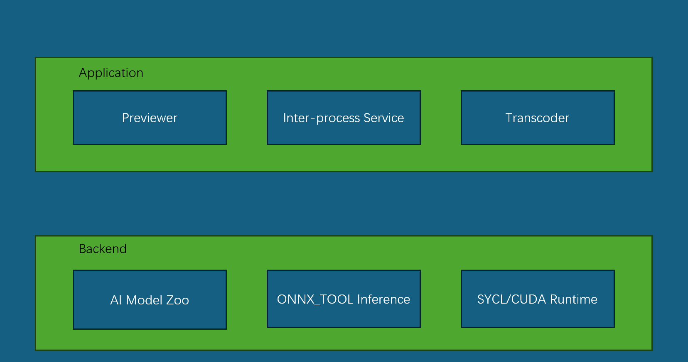
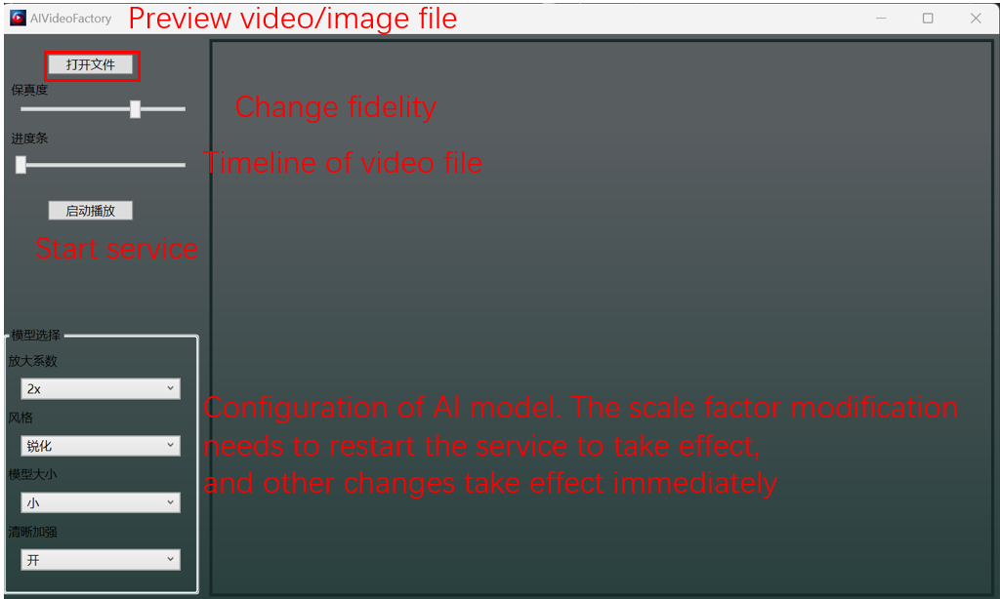
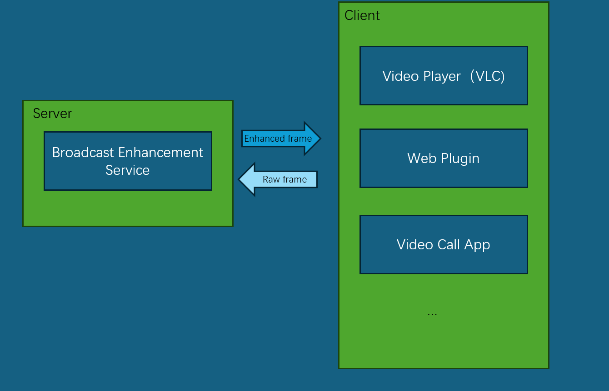
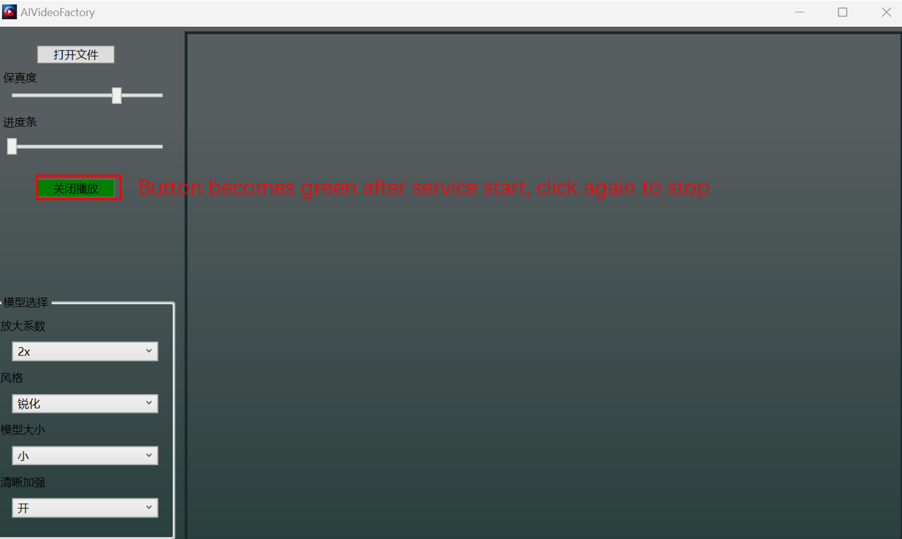
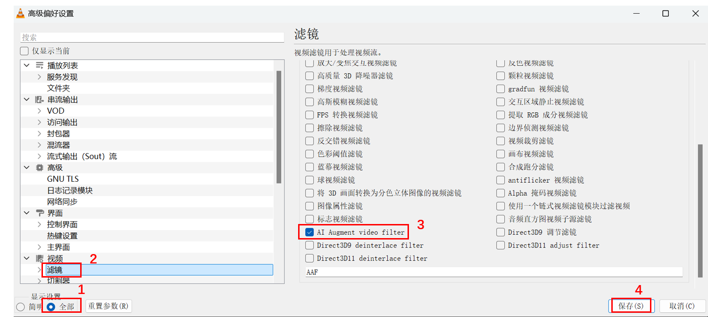

# AI Enhancement Filter

**AI high-fidelity video quality enhancement filter:**
* *[Play](#Real-time-broadcast-service)*
* *[Preview](#Video-image-previewer)*
* *[Transcoding](#Transcoder)*
<p id="icon" align="center">
  
</p>


## Effect comparison
The average bitrate enhancement effect is greater than 150%.
<p id="icon" align="center">
  
</p>

Extremely low quality: old movies, TV series
<p id="low_quality" align="center">
  
</p>

Bitrate enhancement in complex smoke scenes
<p id="high_quality" align="center">
  
</p>

The animation effect is also excellent
<p id="comic" align="center">
  
</p>

## Instructions

### Video image previewer

Open a file (image or video)

<p id="ui" align="center">
  
</p>

### Real-time broadcast service
Start the process monitoring service, and the player plug-in will share each frame of the image 
with the server through the memory between processes for enhancement. After being processed by the server,
it will be returned to the player for display, serving as the player's video filter plug-in.
<p id="icon" align="center">
  
</p>

<p id="icon" align="center">
  
</p>
After starting up, you can enjoy the enhanced image quality by directly opening the video file with the player.

#### VLC Plugin Installation
1. Download `libaivideo_plugin.dll` file
2. Find the installation path of VLC (e.g. `C:\Program Files\VideoLAN\VLC`). Note that only 64-bit VLC is currently supported. If the installation path is `C:\Program Files (x86)`, it means it is a 32-bit version and needs to be reinstalled as a 64-bit version.
3. Copy `libaivideo_plugin.dll` to `C:\Program Files\VideoLAN\VLC\plugins`
4. Open VLC
5. In the menu bar above, select `Tools -> Preferences -> Display Settings: All (lower left corner) -> Video: Filters`
6. Check "AI Augment video filter"
7. OK, exit
<p id="icon" align="center">
  
</p>

### Transcoder
If the hardware computing power is low, you can transcode offline before watching.
```
.\transcoder.exe -i E001.mp4 -b 8000 --p1 20
Usage: ffmpeg_transcoder [-h] [--fps VAR] [--bps VAR] [--in_scale VAR...] [--out_scale VAR...] [--encoder VAR] [--p1 VAR] [--p2 VAR] [--input_files VAR...]

Optional arguments:
  -h, --help            shows help message and exits
  -v, --version         prints version information and exits
  --fps                 frame rate per second [default: 15]
  -b, --bps             K bps of video encoder default auto select by out_scale resolution [default: -1]
  --in_scale            in_scale=xx xx [nargs: 2] [default: {0 0}]
  --out_scale           out_scale=xx xx [nargs: 2] [default: {0 0}]
  -e, --encoder         Select encoder one of ['h264','nvenc'] [default: "h264"]
  --p1                  parameter 1 [default: 70]
  --p2                  parameter 2 [default: 100]
  -i, --input_files     [nargs: 1 or more]
```

`-i can be multiple files, as E001.mp4 E002.mp4 ...`  
`-b the transcoded bitrate`  
`--p1 fidelity [0,100]`  
`--in_scale pre-scale factor of input frames`  
`--out_scale post-scale factor of filtered frames`  

### Transcoder Installation
For transcoding, you need to download an additional ffmpeg transcoding package,
and unzip it to the `win_amd64_intel` folder in the program directory. Use the command line to switch the current directory to the `win_amd64_intel` directory,
and start transcoding directly using the above command line.

## Installation and System Requirements
Download the main package `AIVideoFactoryRelease.7z`  
and download the transcoding package `win_amd64_transcode.7z` according to your needs

System: Windows 11  
Memory: 16GB

Intel: oneAPI 2024.2 (newest driver)
Nvidia: CUDA toolkit 12.6 (GPU driver>=528.33)

Minimum GPU requirements:  
720P playback: Ultra-1 series integrated graphics card  
1080P~1440P playback: Ultra-2 series integrated graphics card, Intel-ArcA750, GTX3060  

